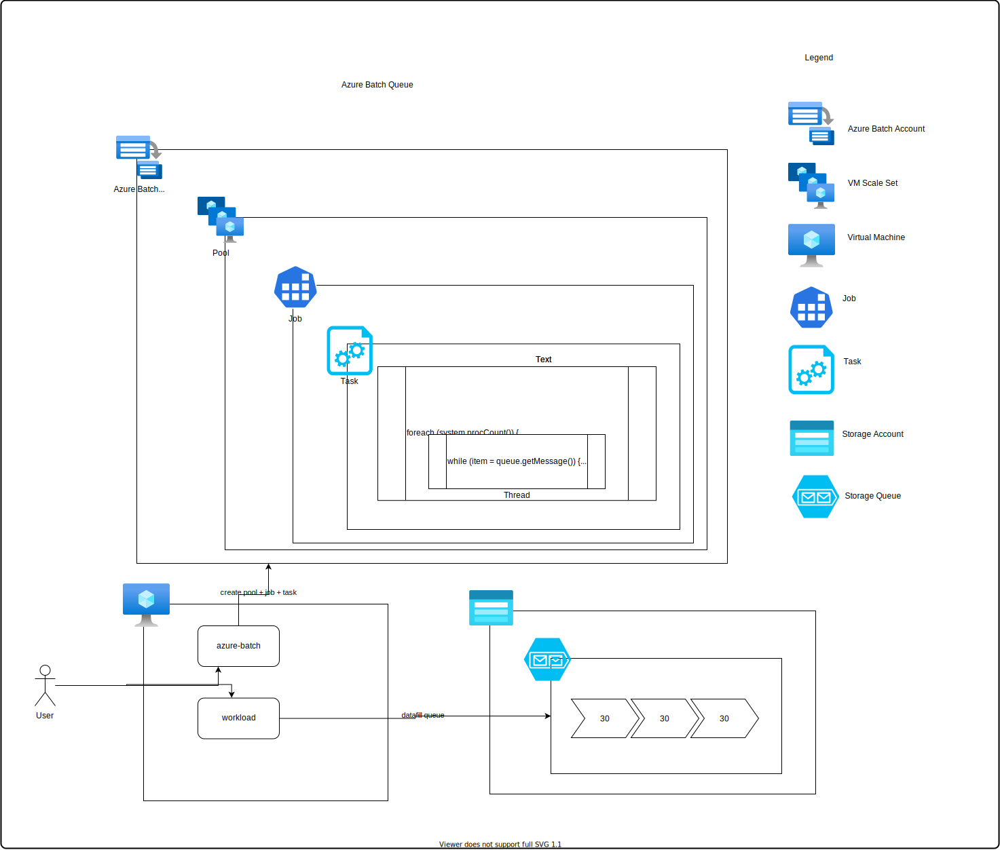

# Azure Batch + Azure Queue example

## Intent

This project is designed as a working example for demonstrating using Azure Batch to drain objects off of an Azure Storage Queue using the [Competing Consumer Architecture Pattern](https://docs.microsoft.com/en-us/azure/architecture/patterns/competing-consumers).

## Design

This repo has two .NET Projects:

* `workload` - A sample app which serves as the workload for Azure Batch.  It has two actions:
  * `produce` - Pushes messages onto the queue.  Each message is a number.  Used for simulating workload generation.
  * `consume` - Pulls items off of the queue and spins up a thread for each processor on the node.  Each thread sleeps for as many seconds as listed in the message value.  This design simulates a thread "consuming" one core and 
* `azure-batch` - Uses the Azure Batch SDK to creat the Pool, Job and Tasks for the workload



## Workflow

Using the default settings, this walkthrough will:

* Push 200 messages to the queue each with the value of `30`
* Create a Pool with 2 Standard_D48_V3 Linux nodes
* Create a Job with 2 tasks (one for each node)
* Each task will start the app which creates 48 threads (one for each core)
* Each thread will sleep for 30 seconds and then try to pull another message from the queue
* If there are no more messages, the thread will complete.  
* Once all threads complete, the task will complete

## Prerequisites

* Azure Batch Account
* .NET SDK
* jq

## Setup

```bash
RG=azure-batch-queue
LOCATION=southcentralus
az group create -n $RG -l $LOCATION

# Create the storage account
STORAGE_NAME=${USER}azurebatchqueue
az storage account create -n $STORAGE_NAME -g $RG --kind StorageV2 -l $LOCATION
export AZURE_STORAGE_CONNECTION_STRING=$(az storage account show-connection-string -g $RG -n $STORAGE_NAME -o json | jq '.connectionString' -r)
az storage queue create -n sleeper --connection-string $AZURE_STORAGE_CONNECTION_STRING

# Create the batch account
BATCH_NAME=${USER}azurebatchqueue
az batch account create -n $BATCH_NAME -g $RG -l $LOCATION --storage-account $STORAGE_NAME
```

## Usage

1. Build the workload
   1. `cd workload`
   1. `dotnet publish -r linux-x64 -c Release --self-contained=true`
1. Push workload messages to the queue
   1. Make sure AZURE_STORAGE_CONNECTION_STRING is set
   3. `dotnet run produce 10 20 30`
      1. This uses 20 threads, each thread creates 10 messages (200 total), each with the value `30`
2. Publish the Azure Batch Application Package
   1. `cd bin/Release/net5.0/linux-x64/publish`
   2. `zip sleeper.zip *`
   3. Upload `sleeper.zip` to [Azure Batch application packages](https://docs.microsoft.com/en-us/azure/batch/batch-application-packages)
      1. `az batch application package create -n $BATCH_NAME -g $RG --application-name sleeper --version-name main --package-file sleeper.zip`
3. Run the Azure Batch Job
   1. From the azure-batch-queue directory `cd azure-batch`
   2. Update `accountsettings.json` with Batch and Storage account settings (required)
      1. These values can be found in the "Settings -> Keys" section of the Azure Portal and the $AZURE_STORAGE_CONNECTION_STRING
   3. Update `settings.json` with the runtime settings (optional)
   4. Run the job
      1. `dotnet run`
   5. This will:
      1. Create a single Azure Batch Pool 
      2. Create an Azure Batch Job
   6. This will NOT:
      1. Cleanup/Delete the nodes after the job is complete.  This is because sometimes there is a failure and if it deletes the node, then you might lose any debugging capabilities
      2. Cleanup/Delete the job.  See above note about debugging.
   7. If successful, the entire operation should take ~3-4 minutes.

